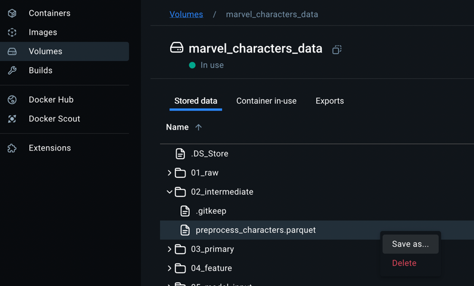

# marvel_characters
[](https://kedro.org)

This project aims to provide a solution for a project interview related to the presence of Marvel characters in
different comics.

## Prerequisites

- `just`: [see here](https://github.com/cajsey/just) `brew install just`
- `python3` (>=3.10 preferred)
- `uv` [see here](https://github.com/astral-sh/uv)
- `pre-commit`: `brew install pre-commit`
- `docker`
- `llvm`: `brew install llvm`

PS: Focusing on macOS commands

Activate the virtual environment with :
```bash
source .venv/bin/activate
```

## Project structure

```text
.
├── Dockerfile
├── README.md
├── compose.yml
├── justfile
├── pyproject.toml
│   └── ...
├── src
│   └── marvel_characters
│       ├── __init__.py
│       └── main.py
│       └── marvel.py
│       └── pipelines.py
│        └── data_processing.py
│         └── pipeline.py
│         └── nodes.py
└── tests
    └── test_marvel_characters.py
```

This project is structured using a `src` layout and is composed of
different components.

- `Dockerfile`: building instructions for Docker.
- `README.md`: this file.
- `compose*.yml`: `docker compose` configuration to run and test the
  project locally.
- `justfile`: Preconfigured list of commands using `just` ([see here](https://github.com/cajsey/just))
- `pyproject.toml`: Python project configuration (dependencies, dev
  tools setup and more)
- `scripts`: Useful scripts for development or deployment.
- `src`: Package code.
- `tests`: Tests code.
- `pipelines`: Part of the Kedro structure used for the data pipeline
([see here](https://docs.kedro.org/en/stable/extend_kedro/architecture_overview.html))

## Setup

Activate the virtual environment with :

```bash
source .venv/bin/activate
```

Don't forget to create the `.env.local` file with the credentials needed.
```md
ENV=local
MARVEL_PRIVATE_KEY=<private_key>
MARVEL_PUBLIC_KEY=<public_key>
OFFSET=90000

```

Check the `justfile` for all the available commands.

## Docker

To use docker to create and run the code:

```bash
just build
just run-full
```

The data can be accessed on the `Docker Desktop > Volume`:


## Documentation

Using [`Sphinx`](https://www.sphinx-doc.org/en/master/usage/quickstart.html)
the documentation can be generated automatically with:

```bash
cd src
make html
```

## Kedro information
### Rules and guidelines

In order to get the best out of the template:

* Don't remove any lines from the `.gitignore` file we provide
* Make sure your results can be reproduced by following a [data engineering convention](https://docs.kedro.org/en/stable/faq/faq.html#what-is-data-engineering-convention)
* Don't commit data to your repository
* Don't commit any credentials or your local configuration to your repository. Keep all your credentials and local configuration in `conf/local/`

### How to run your Kedro pipeline

You can run your Kedro project with:

```
kedro run
```

### How to test your Kedro project

Have a look at the files `src/tests/test_run.py` and `src/tests/pipelines/data_science/test_pipeline.py` for instructions on how to write your tests. Run the tests as follows:

```
pytest
```

To configure the coverage threshold, look at the `.coveragerc` file.

### Project dependencies

To see and update the dependency requirements for your project use `requirements.txt`. You can install the project requirements with `pip install -r requirements.txt`.

[Further information about project dependencies](https://docs.kedro.org/en/stable/kedro_project_setup/dependencies.html#project-specific-dependencies)

### How to work with Kedro and notebooks

> Note: Using `kedro jupyter` or `kedro ipython` to run your notebook provides these variables in scope: `catalog`, `context`, `pipelines` and `session`.
>
> Jupyter, JupyterLab, and IPython are already included in the project requirements by default, so once you have run `pip install -r requirements.txt` you will not need to take any extra steps before you use them.

#### Jupyter
To use Jupyter notebooks in your Kedro project, you need to install Jupyter:

```
pip install jupyter
```

After installing Jupyter, you can start a local notebook server:

```
kedro jupyter notebook
```

#### JupyterLab
To use JupyterLab, you need to install it:

```
pip install jupyterlab
```

You can also start JupyterLab:

```
kedro jupyter lab
```

#### IPython
And if you want to run an IPython session:

```
kedro ipython
```

#### How to ignore notebook output cells in `git`
To automatically strip out all output cell contents before committing to `git`, you can use tools like [`nbstripout`](https://github.com/kynan/nbstripout). For example, you can add a hook in `.git/config` with `nbstripout --install`. This will run `nbstripout` before anything is committed to `git`.

> *Note:* Your output cells will be retained locally.

### Package your Kedro project

[Further information about building project documentation and packaging your project](https://docs.kedro.org/en/stable/tutorial/package_a_project.html)
